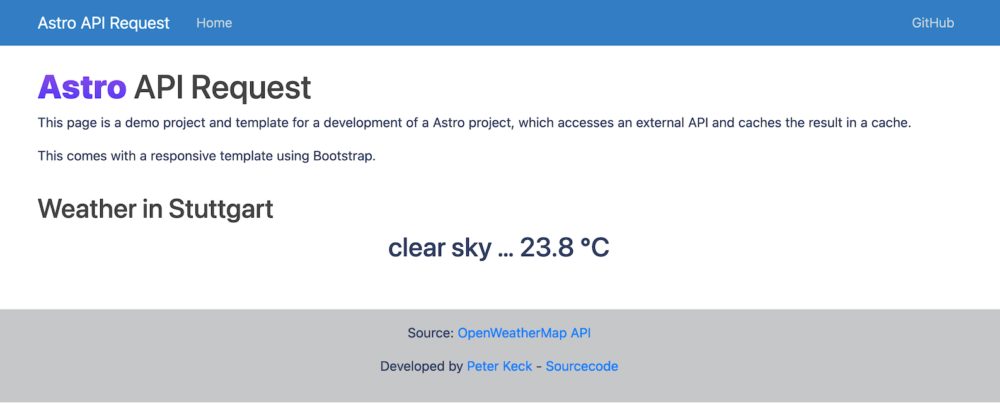

<h1 align="center">Welcome to my api-request collection 👋</h1>

  
  

This repository is a documentation of my learning and training journey and can also be used as a starter for a webapp project or as a cheat sheet for future projects.

The goal is to recreate the same webapp project in different languages, web design patterns and frameworks.

## 📖 Table of contents

* [List of Features](#🔹-list-of-features)
  * [Frontend](#🖥-frontend)
  * [Backend](#💻-backend)
  * [Documentation](#📔-documentation)
* [Demos so far](#☀️-demos-so-far)
  * [Used Languages and more](#💬-used-languages)

## ✨ Demo (OpenWeatherMap-Api - Current weather in Stuttgart, Germany)

Screenshot from [astro-api-request](https://github.com/pyrrolizin/astro-api-request):

## 🔹 List of Features

All of the projects have to fulfil the following minimal features and functions.

**👨‍💻💬 User Stories:**

* As a user I want to fetch the current weather conditions and temperature from Stuttgart (Germany).
* As a developer I want to have clear instructions on how to set up the project and I want to have the API key hidden from the users
* As a api provider I want to have the result of the request cached for 5 minutes in the backend

*Optional or nice to have features are in italic.*

### 🖥 Frontend

* *fetch the current condition and the temperature* (not if SSR)
* present the current condition and the temperature to the user
* use the same template with bootstrap for all projects
* the template must be responsive and mobile first
* round the temperature to one decimal place

### 💻 Backend

* save the API_KEY in configuration file *and in environment variables*
* start a web server
* present the frontend to the user
* hide the api key from the user / client
* fetch the current weather for Stuttgart (Germany) from [openweathermap](https://openweathermap.org/api)
* cache for 5 minutes the response from openweathermap in memory

### 📔 Documentation

* screenshot from the frontend
* complete instructions in README.md-file containing:
  * dependencies
  * how to install modules
  * how to configure the api key
  * how to start the server
  * *how to compile/pack the web application for deployment*
* MIT license

## ☀️ Demos so far

| Repository        | Primary Language(s)   | Web design pattern   | Frontend   | Backend   | Comment
| ---               | ---  | --- | ---- | ---- |---- | 
| [astro-api-request](https://github.com/pyrrolizin/astro-api-request) | Astro / TypeScript | SSR | Astro | Astro | New framework. Very nice! |
| [gin-api-request](https://github.com/pyrrolizin/gin-api-request)   | GoLang | SSR | Gin Template | Gin Framework   | experimental framework    |
| [flask-api-request](https://github.com/pyrrolizin/flask-api-request) | Python | SSR | Jinja Template| Python Flask  | first project     |
| [nextjs-api-request](https://github.com/pyrrolizin/nextjs-api-request) | Next.js / TypeScript | REST-API with Client | React TSX | Next.js | Bootstrap 5 and yarn 3 with zero install  |
| [spring-api-request](https://github.com/pyrrolizin/spring-api-request) | Java (Spring Boot) | REST-API with Client | Vue.js | Spring MVC | maven   |

### 💬 Used Languages

### 🎨 Frontend Tools

### ⚙️ Backend Tools

### 🛠 Development Tools

### 🖥 Developed on

## 👋

Badges from <https://github.com/Ileriayo/markdown-badges> and <https://shields.io/>
